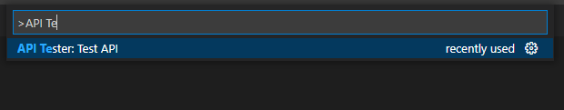

# API Tester

This is a simple extension which provides a tool for testing REST-ful API endpoints

## How to use

Press F1 or Ctrl + Shift + P to open the command pallette, and search for the "API Tester: Test API" command. Then follow the instructions

## Release Notes

### 1.0.0

Initial release of extension
